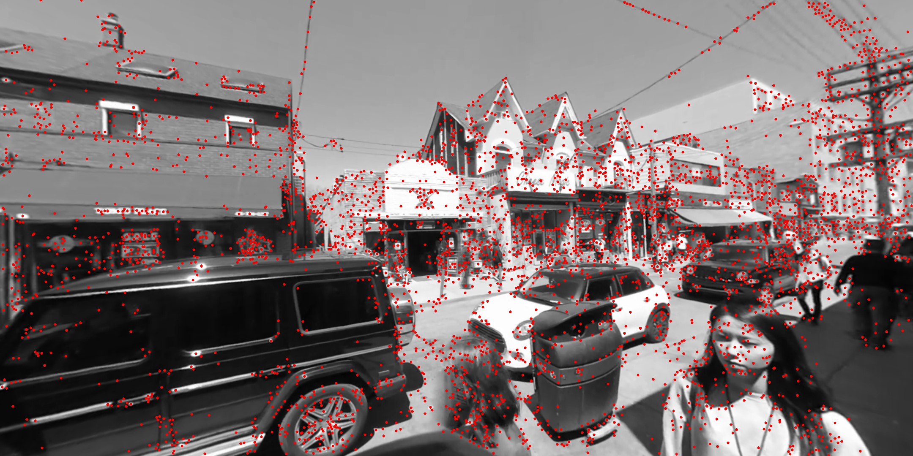
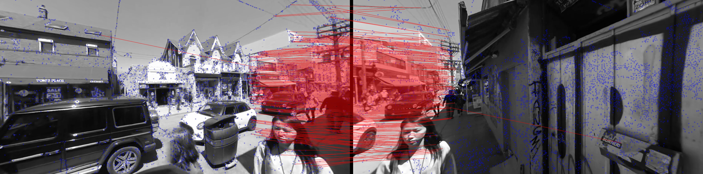
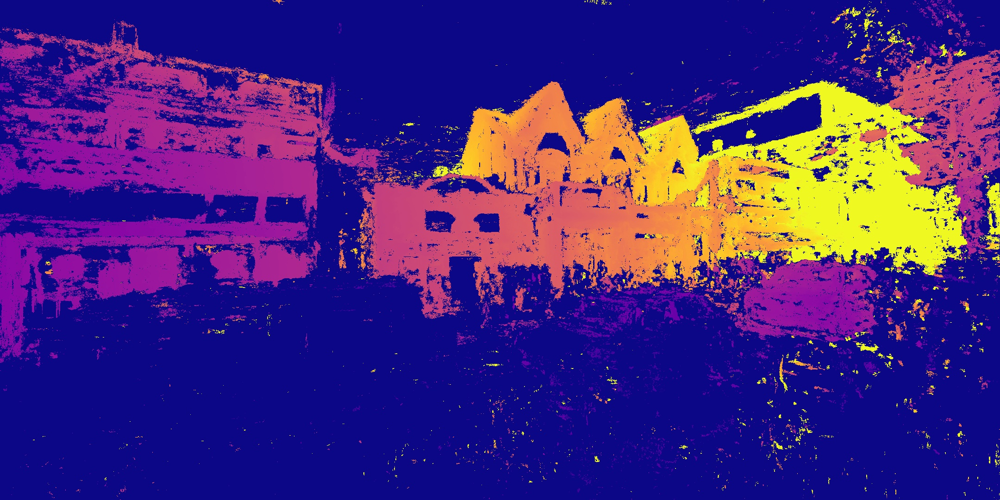
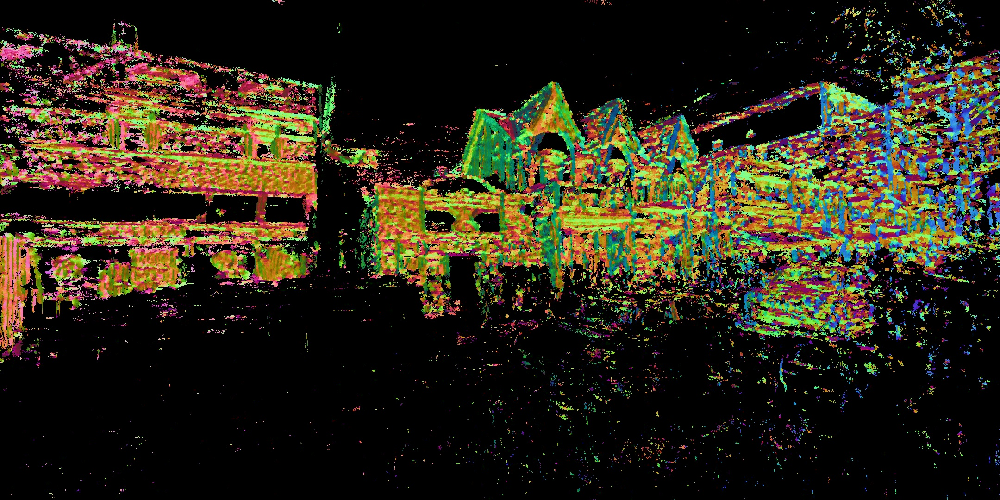

# RECONSTRUCTION SCRIPTS

### AUTOMATED PROCESSING SCRIPTS
1. ```process_video.py```:  
Primary script for generating sparse reconstruction model, using OpenCV to extract frames from source video, generate perspective projections, and issue sequence of COLMAP commands via CLI.

2. ```dense_reconstruction.py```:  
Primary script for generating dense reconstruction from existing sparse reconstruction using COLMAP commands via CLI.

3. ```helpers.py```:  
Assorted methods and object classes used in the sparse and dense reconstruction scripts.

4. ```trim_inputs.py```:  
Extracts trimmed video and audio clips as well as trimmed data from FIT file in JSON format using ```ffmpeg```. Start & end times are specified in seconds.

5. ```fit_dump.py```:  
Extracts all data from binary FIT file to human-readable JSON files.

6. ```gen_tracks.py```:  
Extracts and computes per-image camera position and orientation vector from a sparse reconstruction ```images.bin``` to CSV for use in Unity.

### DATA VISUALIZATION SCRIPTS
1. ```gen_keypoint_label_raster.py```:  
Generates JPGs with labeled feature keypoints, using sparse reconstruction images and database.  


2. ```gen_match_label_raster.py```:  
Generates JPG with side-by-side feature matches labeled using matched image with highest correspondence.  


3. ```gen_dense_raster.py```:  
Generates JPGs from dense reconstruction depth maps and normal maps binary files.


